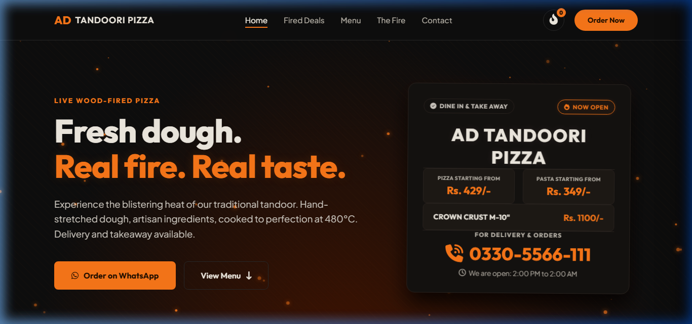
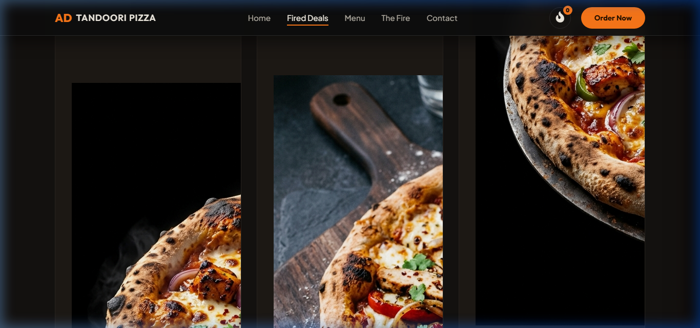
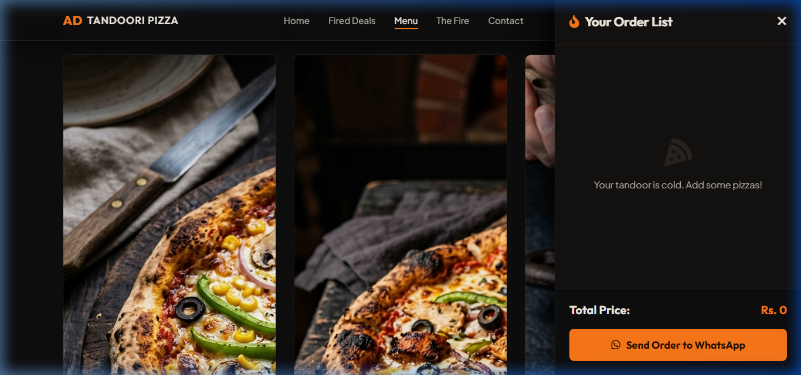

# AD Tandoori Pizza - Live Wood-Fired Pizza Web Ordering Platform

Welcome to **AD Tandoori Pizza**, a premium, high-converting static single-page web application designed for a modern wood-fired pizza kitchen. The website matches the layout, aesthetics, and user flows of top-tier ordering apps like Cheezious.

---

## 📸 Screenshots

### 1. Hero & Branding


### 2. Value Deals Section


### 3. Compact Two-Column Menu & Sticky Cart (Desktop)


---

## 🔥 Key Features

1. **Aesthetic Fire-Theme Color Palette**:
   - **Backgrounds**: Deep near-black (`#0e0e0e`) and card panels (`#151210`, `#1e1a16`).
   - **Accent Colors**: Fire orange (`#ff7a1a`) for highlights, prices, and CTAs.
   - **Text**: Warm off-white (`#f5f0e6`) and secondary muted grey (`#cfcac2`).

2. **Interactive Tandoor Hero**:
   - Centered **Interactive Brand Board** showing delivery hotline (`0330-5566-111`), timings (`2:00 PM to 2:00 AM`), and live status indicators.
   - Glowing radial heat background with animated, cursor-interactive floating canvas embers.

3. **Fired Up Deals Section**:
   - Clean, text-only cards displaying 12 exclusive deals (Deals 1-9, Friends Fiesta, and Family Deals).
   - "Claim Deal" instant cart add mechanism.

4. **Cheezious-Inspired Two-Column Menu Grid**:
   - **Left Column**: Compact, clean category tabs and menu grids displaying 28 food items (pizzas, pastas, rolls, drinks, and extras).
   - **Right Column (Desktop)**: A sticky checkout cart panel that scrolls with the user, showing itemized selection, quantity controls, and total price.
   - **Mobile Viewports**: Sidebar auto-collapses into a floating fire-cart badge and bottom slide-in drawer.

5. **Size and Portion Selectors**:
   - Hand-stretched pizzas feature Small (7"), Medium (10"), Large (13"), and Extra-Large (16") size toggles.
   - Pastas and beverages support Half/Full or bottle size options.
   - Prices and cart calculations update dynamically in Pakistani Rupees (`Rs.`) on selector click.

6. **Instant WhatsApp Checkout Integration**:
   - Generates a beautifully formatted summary of selected items, sizes, quantities, and totals.
   - Opens a pre-filled direct chat to the official hotline: `0330-5566-111`.

---

## 🛠️ Technology Stack

- **Markup**: Semantic HTML5 with custom FontAwesome 6 icons.
- **Styling**: Vanilla CSS3 using modern custom styling tokens (CSS Variables), responsive Flexbox/Grid, sticky scroll, and glowing hover state animations.
- **Logic**: Vanilla ES6+ JavaScript for filter routing, reactive state management, size selection bindings, double-cart UI synchronization, and WhatsApp message compilation.
- **Fonts**: Google Fonts Integration (`Outfit` and `Plus Jakarta Sans`).

---

## 🚀 How to Run Locally

1. Clone this repository:
   ```bash
   git clone https://github.com/HammadGhani23/AD-live-wood-fired-pizza-.git
   cd AD-live-wood-fired-pizza-
   ```

2. Run a static local server (e.g., using `http-server`):
   ```bash
   npx http-server -p 8080
   ```

3. Open your browser and navigate to:
   ```
   http://localhost:8080
   ```
